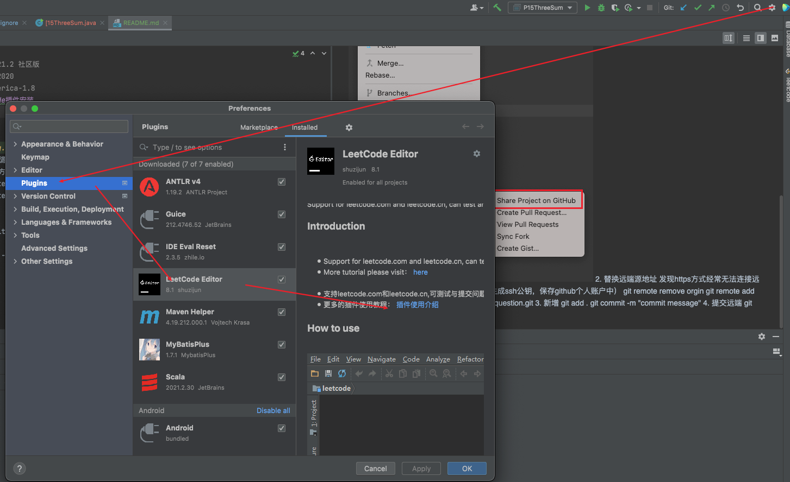
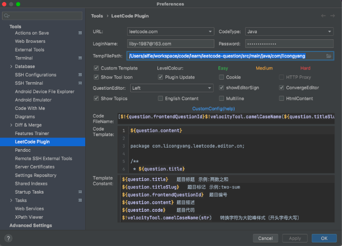
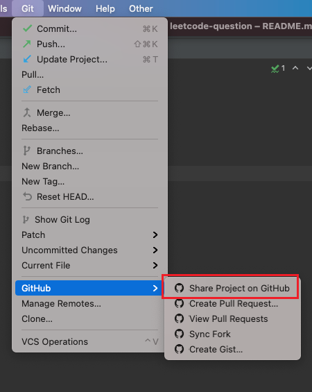

# 环境信息
    - idea 2021.2 社区版
    - mac m1 2020
    - jdk liberica-1.8
# idea leetcode插件安装

# leetcode登陆
 - 通过账户、密码
 - 勾选 Custom Template
 - TempFilePath: 生成文件路径，可新建项目，选择包所在目录
 >  /Users/alfie/workspace/code/learn/leetcode-question/src/main/java/com/licongyang
 - CodeFileName : 生成文件名
 > [$!{question.frontendQuestionId}$!velocityTool.camelCaseName(${question.titleSlug})
 - CodeTemplate: 生成文件内容模版
 ```
 ${question.content}

package com.licongyang.leetcode.editor.cn;

/**
 * ${question.title}
 * @author alfie
 * @date $!velocityTool.date()
 */
class P${question.frontendQuestionId}$!velocityTool.camelCaseName(${question.titleSlug}){
	 public static void main(String[] args) {
	 	 
	 	 Solution solution = new P$!{question.frontendQuestionId}$!velocityTool.camelCaseName(${question.titleSlug})().new Solution();
	 }
	 

${question.code}
}

 ```
 - 通过cookie 
 > 用你的账号在浏览器上登录leetcode.com网站 > 按F12 > 选择network > F5 刷新网页 > 找到graphql这个文件 > 点击后查看 Headers > 下滑找到cookie字段 > 复制cookie: 后的字符（不要 把 cookie:也带上了）
 - 配置如图

<url></url> 
# github同步
  1. 仓库同步



  2. 替换远端源地址 
 发现https方式经常无法连接远端库，所以用ssh方式提交代码
（需要本地生成ssh公钥，保存github个人账户中）
 ```
 git remote remove orgin
 git remote add origin git@github.com:licongyang/leetcode-question.git
 ```
  
  3. 新增
```
git add .
git commit -m "commit message"
```

  4. 提交远端
 ```
 git push -u origin master
 ```